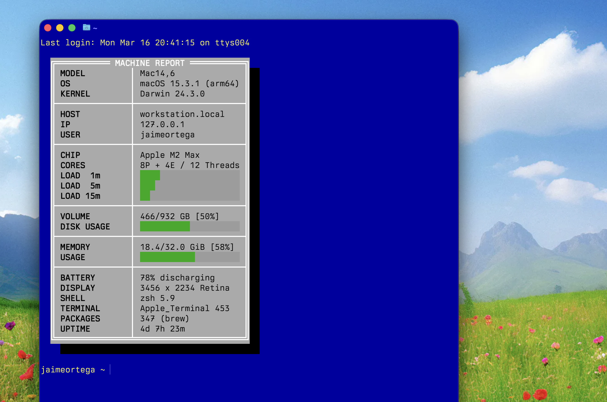

# Machine Report — macOS Edition

A personal fork of [U.S. Graphics Company's TR-100 Machine Report](https://github.com/usgraphics/usgc-machine-report), rewritten for macOS with a Borland Turbo Vision visual style.



The upstream project is a minimal system-info display for Debian/ZFS servers. This version adapts the idea for macOS (Apple Silicon and Intel), adds a retro TUI aesthetic with CGA colors and box-drawing characters, and includes bar graphs for load, disk, and memory.

## What it shows

| Section | Fields |
|---------|--------|
| System | Model, OS version, kernel |
| Network | Hostname, IP, current user |
| CPU | Chip name, core breakdown (P+E/threads), 1/5/15m load bars |
| Storage | APFS volume usage with bar graph |
| Memory | Used/total with bar graph |
| Misc | Battery, display resolution, shell, terminal, Homebrew packages, uptime |

## Installation

```bash
# 1. Copy the script
cp machine_report.sh ~/.machine_report.sh
chmod +x ~/.machine_report.sh

# 2. Add to your shell rc file (~/.zshrc or ~/.bashrc)
echo 'if [[ $- == *i* ]]; then
    source ~/.machine_report.sh
fi' >> ~/.zshrc
```

Open a new terminal window to see the report.

## Differences from upstream

- **Target platform**: macOS instead of Debian/ZFS — uses `sysctl`, `sw_vers`, `diskutil`, `pmset`, `vm_stat`, and `system_profiler`
- **Visual style**: Borland Turbo Vision TUI with CGA colors, double-line box drawing, bar graphs, and a drop shadow
- **Demo mode**: Set `DEMO_MODE=true` at the top of the script to display fake data — useful for screenshots or demos without exposing real system info
- **Extra fields**: Battery status, display resolution, Homebrew package count

## Customization

Following the upstream philosophy — **edit the source directly**. There is no config file. The script is organized in clearly marked sections:

- **Configuration** — title, demo mode toggle
- **Colors** — all CGA palette values as 24-bit ANSI escapes
- **Layout** — column width limits, indent
- **Data gathering** — one block per data category, all macOS-native
- **Demo mode overrides** — fake values for each field
- **Output** — the print order; rearrange, add, or remove rows here

To port to a new machine, the only section that needs changing is **Data gathering** — the rendering code is platform-independent.

## Requirements

- macOS (tested on Apple Silicon, should work on Intel Macs)
- A terminal with truecolor (24-bit) support (Terminal.app, iTerm2, Kitty, Alacritty, etc.)
- Bash 3.2+ (ships with macOS) or Zsh

## License

BSD-3-Clause — inherited from [upstream](https://github.com/usgraphics/usgc-machine-report).
